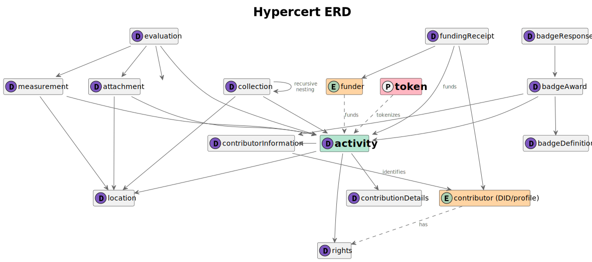
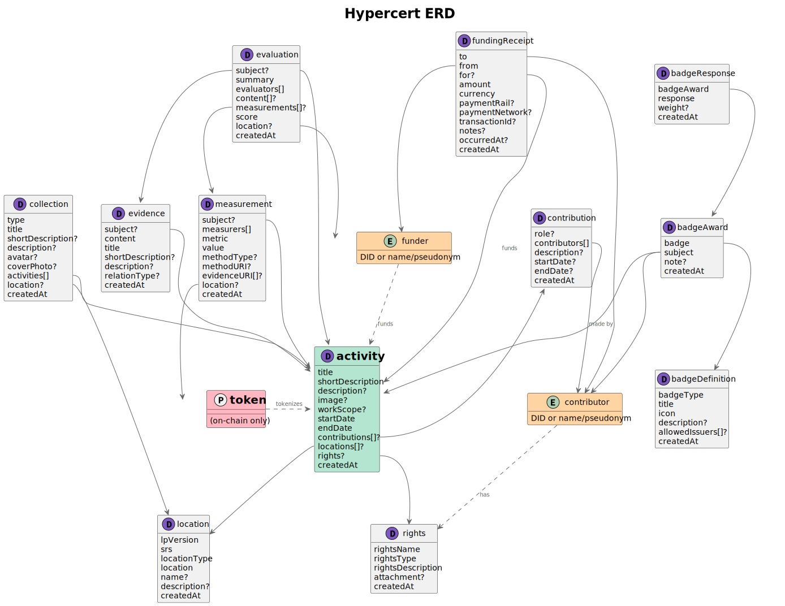

# Hypercerts Lexicon Documentation

This repository contains ATProto lexicon definitions for the
Hypercerts protocol. Each lexicon defines a record type that can be
stored on the ATProto network.

## Entity Relationship Diagram

The following diagrams show the relationship between:

- data classes represented by ATProto lexicons, which model the data
  sets relating to hypercerts

- contributors to activity records (modelled/identified by ATProto
  DIDs rather than lexicons)

- hypercerts protocol tokens which are onchain representations of
  activity records in ATProto

Note that contributors and tokens do not require lexicons.

To distinguish these in the diagrams, each class has one of the
following icons:

- "D" means "data class"
- "E" means "entity"
- "P" means "protocol"



<details>
<summary>View ERD with field details</summary>



</details>

## Installation

```
npm i @hypercerts-org/lexicon
```

## Usage

```typescript
import { AtpBaseClient } from "@hypercerts-org/lexicon";
import type { HypercertClaim } from "@hypercerts-org/lexicon";

const client = new AtpBaseClient({
  service: "https://bsky.social",
  headers: { Authorization: `Bearer ${token}` },
});

const hypercert: HypercertClaim = {
  $type: "org.hypercerts.claim.activity",
  title: "My Impact Work",
  shortDescription: "Description here",
  workScope: "Scope of work",
  startDate: "2023-01-01T00:00:00Z",
  endDate: "2023-12-31T23:59:59Z",
  createdAt: new Date().toISOString(),
};

await client.org.hypercerts.claim.activity.create(
  { repo: "did:plc:example" },
  hypercert,
);
```

## Certified Lexicons

Certified lexicons are common/shared lexicons that can be used across multiple protocols.

### Common Definitions

**Lexicon ID:** `org.hypercerts.defs`

**Description:** Common type definitions used across all certified protocols.

#### Defs

| Def          | Type     | Description                               | Comments                                |
| ------------ | -------- | ----------------------------------------- | --------------------------------------- |
| `uri`        | `object` | Object containing a URI to external data  | Has `uri` property (string, format uri) |
| `smallBlob`  | `object` | Object containing a blob to external data | Has `blob` property (blob, up to 10MB)  |
| `largeBlob`  | `object` | Object containing a blob to external data | Has `blob` property (blob, up to 100MB) |
| `smallImage` | `object` | Object containing a small image           | Has `image` property (blob, up to 5MB)  |
| `largeImage` | `object` | Object containing a large image           | Has `image` property (blob, up to 10MB) |

---

### Location Lexicon

**Lexicon ID:** `app.certified.location`

**Description:** A location reference for use across certified protocols. For more information about

**Key:** `tid`

#### Properties

| Property       | Type     | Required | Description                                                                                                               | Comments |
| -------------- | -------- | -------- | ------------------------------------------------------------------------------------------------------------------------- | -------- |
| `lpVersion`    | `string` | ✅       | The version of the Location Protocol                                                                                      |          |
| `srs`          | `string` | ✅       | The Spatial Reference System URI (e.g., http://www.opengis.net/def/crs/OGC/1.3/CRS84) that defines the coordinate system. |          |
| `locationType` | `string` | ✅       | An identifier for the format of the location data (e.g., coordinate-decimal, geojson-point)                               |          |
| `location`     | `union`  | ✅       | The location of where the work was performed as a URI or blob.                                                            |          |
| `name`         | `string` | ❌       | Optional name for this location                                                                                           |          |
| `description`  | `string` | ❌       | Optional description for this location                                                                                    |          |
| `createdAt`    | `string` | ✅       | Client-declared timestamp when this record was originally created                                                         |          |

### Badges Lexicon

**Lexicon IDs:** `app.certified.badge.definition`, `app.certified.badge.award`, `app.certified.badge.response`

**Description:** Defines badge metadata, award records, and recipient responses for certified badges that can be used across protocols.

#### Badge Definition

**Lexicon ID:** `app.certified.badge.definition`

**Key:** `tid`

| Property         | Type     | Required | Description                                                            |
| ---------------- | -------- | -------- | ---------------------------------------------------------------------- |
| `badgeType`      | `string` | ✅       | Category of the badge (e.g., endorsement, participation, affiliation). |
| `title`          | `string` | ✅       | Human-readable title of the badge.                                     |
| `icon`           | `blob`   | ✅       | Icon representing the badge (accepted `image/*` types, maxSize 1MB).   |
| `description`    | `string` | ❌       | Optional short statement describing the badge.                         |
| `allowedIssuers` | `array`  | ❌       | Optional allowlist of DIDs allowed to issue this badge.                |
| `createdAt`      | `string` | ✅       | Client-declared timestamp when this record was originally created.     |

#### Badge Award

**Lexicon ID:** `app.certified.badge.award`

**Key:** `tid`

| Property    | Type     | Required | Description                                                                          |
| ----------- | -------- | -------- | ------------------------------------------------------------------------------------ |
| `badge`     | `ref`    | ✅       | Reference to the badge definition for this award (`app.certified.badge.definition`). |
| `subject`   | `union`  | ✅       | Entity the badge award is for (either a DID or a specific AT Protocol record).       |
| `note`      | `string` | ❌       | Optional explanation for the award.                                                  |
| `createdAt` | `string` | ✅       | Client-declared timestamp when this record was originally created.                   |

#### Badge Response

**Lexicon ID:** `app.certified.badge.response`

**Key:** `tid`

| Property     | Type     | Required | Description                                                            |
| ------------ | -------- | -------- | ---------------------------------------------------------------------- |
| `badgeAward` | `ref`    | ✅       | Reference to the badge award (`app.certified.badge.award`).            |
| `response`   | `string` | ✅       | Enum: `accepted` or `rejected`.                                        |
| `weight`     | `string` | ❌       | Optional relative weight assigned by the recipient (stored as string). |
| `createdAt`  | `string` | ✅       | Client-declared timestamp when this record was originally created.     |

---

## Hypercerts Lexicons

Hypercerts-specific lexicons for tracking impact work and claims.

### Hypercerts Activity Claim

**Lexicon ID:** `org.hypercerts.claim.activity`

**Description:** The main lexicon where everything is connected to. This is the hypercert record that tracks impact work.

**Key:** `any`

#### Properties

| Property           | Type     | Required | Description                                                                         | Comments                                                                  |
| ------------------ | -------- | -------- | ----------------------------------------------------------------------------------- | ------------------------------------------------------------------------- |
| `title`            | `string` | ✅       | Title of the hypercert                                                              |                                                                           |
| `shortDescription` | `string` | ✅       | Short blurb of the impact work done.                                                |                                                                           |
| `description`      | `string` | ❌       | Optional longer description of the impact work done.                                |                                                                           |
| `image`            | `union`  | ❌       | The hypercert visual representation as a URI or image blob                          |                                                                           |
| `workScope`        | `object` | ❌       | Logical scope of the work using label-based conditions                              | Object with `withinAllOf`, `withinAnyOf`, `withinNoneOf` arrays of labels |
| `startDate`        | `string` | ✅       | When the work began                                                                 |                                                                           |
| `endDate`          | `string` | ✅       | When the work ended                                                                 |                                                                           |
| `contributions`    | `array`  | ❌       | A strong reference to the contributions done to create the impact in the hypercerts | References must conform to `org.hypercerts.claim.contribution`            |
| `rights`           | `ref`    | ❌       | A strong reference to the rights that this hypercert has                            | References must conform to `org.hypercerts.claim.rights`                  |
| `location`         | `ref`    | ❌       | A strong reference to the location where the work for done hypercert was located    | References must conform to `app.certified.location`                       |
| `project`          | `string` | ❌       | A reference (AT-URI) to the project record that this activity is part of            | References must conform to `org.hypercerts.claim.project`                 |
| `createdAt`        | `string` | ✅       | Client-declared timestamp when this record was originally created                   |                                                                           |

#### Defs

##### activityWeight

| Property   | Type     | Required | Description                                                                                                                                                                      | Comments |
| ---------- | -------- | -------- | -------------------------------------------------------------------------------------------------------------------------------------------------------------------------------- | -------- |
| `activity` | `ref`    | ✅       | A strong reference to a hypercert activity record. This activity must conform to the lexicon org.hypercerts.claim.activity                                                       |          |
| `weight`   | `string` | ✅       | The weight/importance of this hypercert activity (a percentage from 0-100, stored as a string to avoid float precision issues). The total activity weights should add up to 100. |          |

---

### Hypercerts Contribution

**Lexicon ID:** `org.hypercerts.claim.contribution`

**Description:** A contribution made toward a hypercert's impact.

**Key:** `tid`

#### Properties

| Property       | Type     | Required | Description                                                                                                                                                             | Comments |
| -------------- | -------- | -------- | ----------------------------------------------------------------------------------------------------------------------------------------------------------------------- | -------- |
| `role`         | `string` | ❌       | Role or title of the contributor(s).                                                                                                                                    |          |
| `contributors` | `array`  | ✅       | List of the contributors (names, pseudonyms, or DIDs). If multiple contributors are stored in the same hypercertContribution, then they would have the exact same role. |          |
| `description`  | `string` | ❌       | What the contribution concretely achieved                                                                                                                               |          |
| `startDate`    | `string` | ❌       | When this contribution started. This should be a subset of the hypercert timeframe.                                                                                     |          |
| `endDate`      | `string` | ❌       | When this contribution finished. This should be a subset of the hypercert timeframe.                                                                                    |          |
| `createdAt`    | `string` | ✅       | Client-declared timestamp when this record was originally created                                                                                                       |          |

---

### Hypercerts Evaluation

**Lexicon ID:** `org.hypercerts.claim.evaluation`

**Description:** An evaluation of a hypercert record (e.g. an activity and its impact).

**Key:** `tid`

#### Properties

| Property       | Type     | Required | Description                                                                 | Comments                                                      |
| -------------- | -------- | -------- | --------------------------------------------------------------------------- | ------------------------------------------------------------- |
| `subject`      | `ref`    | ❌       | A strong reference to what is being evaluated                               | (e.g activity, measurement, contribution, etc.)               |
| `evaluators`   | `array`  | ✅       | DIDs of the evaluators                                                      |                                                               |
| `content`      | `array`  | ❌       | Evaluation data (URIs or blobs) containing detailed reports or methodology  |                                                               |
| `measurements` | `array`  | ❌       | Optional references to the measurements that contributed to this evaluation | References must conform to `org.hypercerts.claim.measurement` |
| `summary`      | `string` | ✅       | Brief evaluation summary                                                    |                                                               |
| `score`        | `object` | ❌       | Optional overall score for this evaluation on a numeric scale               | Object with `min`, `max`, and `value` (integers)              |
| `location`     | `ref`    | ❌       | An optional reference for georeferenced evaluations                         | References must conform to `app.certified.location`           |
| `createdAt`    | `string` | ✅       | Client-declared timestamp when this record was originally created           |                                                               |

---

### Hypercerts Evidence

**Lexicon ID:** `org.hypercerts.claim.evidence`

**Description:** A piece of evidence related to a hypercert record (e.g. an activity, project, claim, or evaluation). Evidence may support, clarify, or challenge the referenced subject.

**Key:** `tid`

#### Properties

| Property           | Type     | Required | Description                                                       | Comments                                             |
| ------------------ | -------- | -------- | ----------------------------------------------------------------- | ---------------------------------------------------- |
| `subject`          | `ref`    | ❌       | A strong reference to the record this evidence relates to         | (e.g. an activity, project, claim, or evaluation)    |
| `content`          | `union`  | ✅       | A piece of evidence (URI or blob) related to the subject record   | May support, clarify, or challenge a hypercert claim |
| `title`            | `string` | ✅       | Title to describe the nature of the evidence                      |                                                      |
| `shortDescription` | `string` | ❌       | Short description explaining what this evidence shows             |                                                      |
| `description`      | `string` | ❌       | Longer description describing the evidence in more detail         |                                                      |
| `relationType`     | `string` | ❌       | How this evidence relates to the subject                          | Known values: `supports`, `challenges`, `clarifies`  |
| `createdAt`        | `string` | ✅       | Client-declared timestamp when this record was originally created |                                                      |

---

### org.hypercerts.claim.measurement

**Lexicon ID:** `org.hypercerts.claim.measurement`

**Description:** Measurement data related to a hypercert record (e.g. an activity and its impact).

**Key:** `tid`

#### Properties

| Property      | Type     | Required | Description                                                                   | Comments                                                     |
| ------------- | -------- | -------- | ----------------------------------------------------------------------------- | ------------------------------------------------------------ |
| `subject`     | `ref`    | ❌       | A strong reference to the record this measurement refers to                   | (e.g. an activity, project, or claim)                        |
| `measurers`   | `array`  | ✅       | DIDs of the entity (or entities) that measured this data                      |                                                              |
| `metric`      | `string` | ✅       | The metric being measured                                                     |                                                              |
| `value`       | `string` | ✅       | The measured value                                                            |                                                              |
| `methodType`  | `string` | ❌       | Short identifier for the measurement methodology                              |                                                              |
| `methodURI`   | `string` | ❌       | URI to methodology documentation, standard protocol, or measurement procedure |                                                              |
| `evidenceURI` | `array`  | ❌       | URIs to related evidence or underlying data                                   | (e.g. org.hypercerts.claim.evidence records or raw datasets) |
| `location`    | `ref`    | ❌       | A strong reference to the location where the measurement was taken            | References must conform to `app.certified.location`          |
| `createdAt`   | `string` | ✅       | Client-declared timestamp when this record was originally created             |                                                              |

---

### org.hypercerts.claim.collection

**Lexicon ID:** `org.hypercerts.claim.collection`

**Description:** A collection/group of hypercerts that have a specific property.

**Key:** `tid`

#### Properties

| Property           | Type     | Required | Description                                                             | Comments                                                            |
| ------------------ | -------- | -------- | ----------------------------------------------------------------------- | ------------------------------------------------------------------- |
| `title`            | `string` | ✅       | The title of this collection                                            |                                                                     |
| `shortDescription` | `string` | ❌       | A short description of this collection                                  |                                                                     |
| `avatar`           | `blob`   | ❌       | Primary avatar image representing this collection across apps and views | Typically a square image                                            |
| `coverPhoto`       | `blob`   | ❌       | The cover photo of this collection                                      |                                                                     |
| `activities`       | `array`  | ✅       | Array of activities with their associated weights in this collection    | Each item references `org.hypercerts.claim.activity#activityWeight` |
| `createdAt`        | `string` | ✅       | Client-declared timestamp when this record was originally created       |                                                                     |

---

### org.hypercerts.claim.project

**Lexicon ID:** `org.hypercerts.claim.project`

**Description:** A project that can include multiple activities, each of which may be linked to at most one project.

**Key:** `tid`

#### Properties

| Property           | Type     | Required | Description                                                                     | Comments                                                            |
| ------------------ | -------- | -------- | ------------------------------------------------------------------------------- | ------------------------------------------------------------------- |
| `title`            | `string` | ✅       | Title of this project                                                           |                                                                     |
| `shortDescription` | `string` | ✅       | Short summary of this project, suitable for previews and list views             |                                                                     |
| `description`      | `ref`    | ❌       | Rich-text description of this project, represented as a Leaflet linear document | References must conform to `pub.leaflet.pages.linearDocument#main`  |
| `avatar`           | `blob`   | ❌       | Primary avatar image representing this project across apps and views            | Typically a square logo or project identity image                   |
| `coverPhoto`       | `blob`   | ❌       | The cover photo of this project                                                 |                                                                     |
| `activities`       | `array`  | ❌       | Array of activities with their associated weights in this project               | Each item references `org.hypercerts.claim.activity#activityWeight` |
| `location`         | `ref`    | ❌       | A strong reference to a location record describing where the work took place    | References must conform to `app.certified.location`                 |
| `createdAt`        | `string` | ✅       | Client-declared timestamp when this record was originally created               |                                                                     |

---

### org.hypercerts.claim.rights

**Lexicon ID:** `org.hypercerts.claim.rights`

**Description:** Describes the rights that a contributor and/or an owner has, such as whether the hypercert can be sold, transferred, and under what conditions.

**Key:** `tid`

#### Properties

| Property            | Type     | Required | Description                                                       | Comments    |
| ------------------- | -------- | -------- | ----------------------------------------------------------------- | ----------- |
| `rightsName`        | `string` | ✅       | Full name of the rights                                           |             |
| `rightsType`        | `string` | ✅       | Short rights identifier for easier search                         |             |
| `rightsDescription` | `string` | ✅       | Description of the rights of this hypercert                       |             |
| `attachment`        | `union`  | ❌       | An attachment to define the rights further, e.g. a legal document | URI or blob |
| `createdAt`         | `string` | ✅       | Client-declared timestamp when this record was originally created |             |

---

### org.hypercerts.funding.receipt

**Lexicon ID:** `org.hypercerts.funding.receipt`

**Description:** Records a funding receipt for a payment from one user to another user. It may be recorded by the recipient, by the sender, or by a third party. The sender may remain anonymous.

**Key:** `tid`

#### Properties

| Property         | Type     | Required | Description                                                                                                                 | Comments                                                    |
| ---------------- | -------- | -------- | --------------------------------------------------------------------------------------------------------------------------- | ----------------------------------------------------------- |
| `from`           | `string` | ✅       | DID of the sender who transferred the funds. If sender wants to stay anonymous, mark this explicitly.                       | Format: did                                                 |
| `to`             | `string` | ✅       | The recipient of the funds, who can be identified by DID or a clear-text name.                                              |                                                             |
| `amount`         | `string` | ✅       | Amount of funding received.                                                                                                 |                                                             |
| `currency`       | `string` | ✅       | Currency of the payment (e.g. EUR, USD, ETH).                                                                               |                                                             |
| `paymentRail`    | `string` | ❌       | How the funds were transferred (e.g. bank_transfer, credit_card, onchain, cash, check, payment_processor).                  |                                                             |
| `paymentNetwork` | `string` | ❌       | Optional network within the payment rail (e.g. arbitrum, ethereum, sepa, visa, paypal).                                     |                                                             |
| `transactionId`  | `string` | ❌       | Identifier of the underlying payment transaction (e.g. bank reference, onchain transaction hash, or processor-specific ID). | Use paymentNetwork to specify the network where applicable. |
| `for`            | `string` | ❌       | Optional reference to the activity, project, or organization this funding relates to.                                       | Format: at-uri                                              |
| `notes`          | `string` | ❌       | Optional notes or additional context for this funding receipt.                                                              | maxLength: 500                                              |
| `occurredAt`     | `string` | ❌       | Timestamp when the payment occurred.                                                                                        | Format: datetime                                            |
| `createdAt`      | `string` | ✅       | Client-declared timestamp when this receipt record was created.                                                             | Format: datetime                                            |

---

## Notes

- All timestamps use the `datetime` format (ISO 8601)
- Strong references (`com.atproto.repo.strongRef`) include both the URI and CID of the referenced record
- Union types allow multiple possible formats (e.g., URI or blob)
- Array items may have constraints like `maxLength` to limit the number of elements
- String fields may have both `maxLength` (bytes) and `maxGraphemes` (Unicode grapheme clusters) constraints
