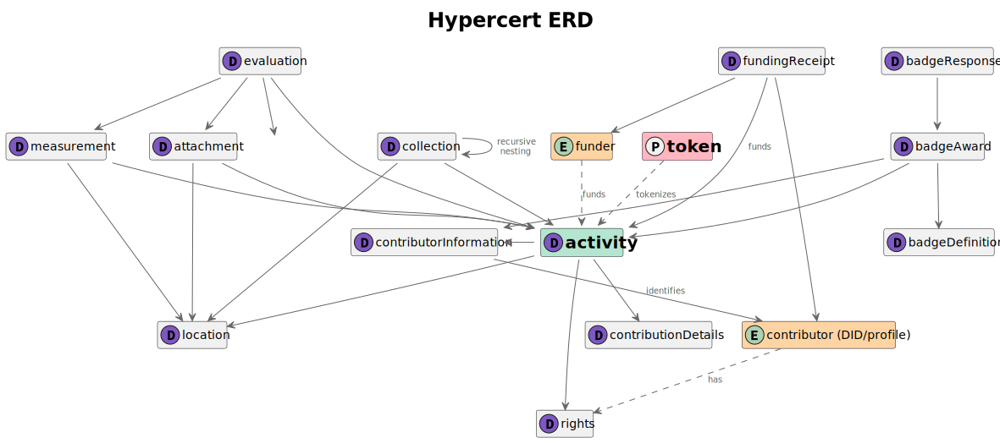
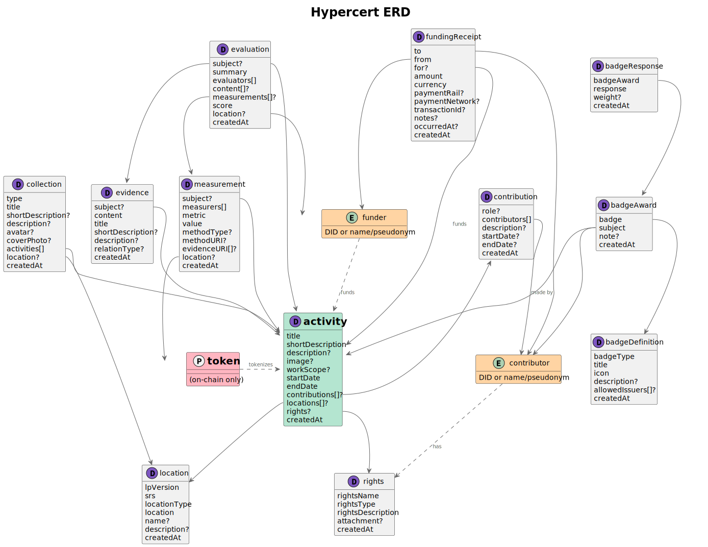

# Hypercerts Lexicon Documentation

This repository contains ATProto lexicon definitions for the
Hypercerts protocol. Each lexicon defines a record type that can be
stored on the ATProto network.

## Entity Relationship Diagram

The following diagrams show the relationship between:

- data classes represented by ATProto lexicons, which model the data
  sets relating to hypercerts

- contributors to activity records (modelled/identified by ATProto
  DIDs rather than lexicons)

- hypercerts protocol tokens which are onchain representations of
  activity records in ATProto

Note that contributors and tokens do not require lexicons.

To distinguish these in the diagrams, each class has one of the
following icons:

- "D" means "data class"
- "E" means "entity"
- "P" means "protocol"



<details>
<summary>View ERD with field details</summary>



</details>

## Installation

```bash
npm i @hypercerts-org/lexicon
```

## Usage

```typescript
import { AtpBaseClient } from "@hypercerts-org/lexicon";
import type { HypercertClaim } from "@hypercerts-org/lexicon";

const client = new AtpBaseClient({
  service: "https://bsky.social",
  headers: { Authorization: `Bearer ${token}` },
});

const hypercert: HypercertClaim = {
  $type: "org.hypercerts.claim.activity",
  title: "My Impact Work",
  shortDescription: "Description here",
  workScope: "Scope of work",
  startDate: "2023-01-01T00:00:00Z",
  endDate: "2023-12-31T23:59:59Z",
  createdAt: new Date().toISOString(),
};

await client.org.hypercerts.claim.activity.create(
  { repo: "did:plc:example" },
  hypercert,
);
```

## Certified Lexicons

Certified lexicons are common/shared lexicons that can be used across multiple protocols.

### Common Definitions

**Lexicon ID:** `org.hypercerts.defs`

**Description:** Common type definitions used across all certified protocols.

#### Defs

| Def          | Type     | Description                               | Comments                                |
| ------------ | -------- | ----------------------------------------- | --------------------------------------- |
| `uri`        | `object` | Object containing a URI to external data  | Has `uri` property (string, format uri) |
| `smallBlob`  | `object` | Object containing a blob to external data | Has `blob` property (blob, up to 10MB)  |
| `largeBlob`  | `object` | Object containing a blob to external data | Has `blob` property (blob, up to 100MB) |
| `smallImage` | `object` | Object containing a small image           | Has `image` property (blob, up to 5MB)  |
| `largeImage` | `object` | Object containing a large image           | Has `image` property (blob, up to 10MB) |

---

### Location Lexicon

**Lexicon ID:** `app.certified.location`

**Description:** A location reference for use across certified protocols. For more information about

**Key:** `tid`

#### Properties

| Property       | Type     | Required | Description                                                                                                               |
| -------------- | -------- | -------- | ------------------------------------------------------------------------------------------------------------------------- |
| `lpVersion`    | `string` | ✅       | The version of the Location Protocol                                                                                      |
| `srs`          | `string` | ✅       | The Spatial Reference System URI (e.g., http://www.opengis.net/def/crs/OGC/1.3/CRS84) that defines the coordinate system. |
| `locationType` | `string` | ✅       | An identifier for the format of the location data (e.g., coordinate-decimal, geojson-point)                               |
| `location`     | `union`  | ✅       | The location of where the work was performed as a URI or blob.                                                            |
| `name`         | `string` | ❌       | Optional name for this location                                                                                           |
| `description`  | `string` | ❌       | Optional description for this location                                                                                    |
| `createdAt`    | `string` | ✅       | Client-declared timestamp when this record was originally created                                                         |

### Badges Lexicon

**Lexicon IDs:** `app.certified.badge.definition`, `app.certified.badge.award`, `app.certified.badge.response`

**Description:** Defines badge metadata, award records, and recipient responses for certified badges that can be used across protocols.

#### Badge Definition

**Lexicon ID:** `app.certified.badge.definition`

**Key:** `tid`

| Property         | Type     | Required | Description                                                            |
| ---------------- | -------- | -------- | ---------------------------------------------------------------------- |
| `badgeType`      | `string` | ✅       | Category of the badge (e.g., endorsement, participation, affiliation). |
| `title`          | `string` | ✅       | Human-readable title of the badge.                                     |
| `icon`           | `blob`   | ✅       | Icon representing the badge (accepted `image/*` types, maxSize 1MB).   |
| `description`    | `string` | ❌       | Optional short statement describing the badge.                         |
| `allowedIssuers` | `array`  | ❌       | Optional allowlist of DIDs allowed to issue this badge.                |
| `createdAt`      | `string` | ✅       | Client-declared timestamp when this record was originally created.     |

#### Badge Award

**Lexicon ID:** `app.certified.badge.award`

**Key:** `tid`

| Property    | Type     | Required | Description                                                                          |
| ----------- | -------- | -------- | ------------------------------------------------------------------------------------ |
| `badge`     | `ref`    | ✅       | Reference to the badge definition for this award (`app.certified.badge.definition`). |
| `subject`   | `union`  | ✅       | Entity the badge award is for (either a DID or a specific AT Protocol record).       |
| `note`      | `string` | ❌       | Optional explanation for the award.                                                  |
| `createdAt` | `string` | ✅       | Client-declared timestamp when this record was originally created.                   |

#### Badge Response

**Lexicon ID:** `app.certified.badge.response`

**Key:** `tid`

| Property     | Type     | Required | Description                                                            |
| ------------ | -------- | -------- | ---------------------------------------------------------------------- |
| `badgeAward` | `ref`    | ✅       | Reference to the badge award (`app.certified.badge.award`).            |
| `response`   | `string` | ✅       | Enum: `accepted` or `rejected`.                                        |
| `weight`     | `string` | ❌       | Optional relative weight assigned by the recipient (stored as string). |
| `createdAt`  | `string` | ✅       | Client-declared timestamp when this record was originally created.     |

---

## Hypercerts Lexicons

Hypercerts-specific lexicons for tracking impact work and claims.

### Hypercerts Activity Claim

**Lexicon ID:** `org.hypercerts.claim.activity`

**Description:** The main lexicon where everything is connected to. This is the hypercert record that tracks impact work.

**Key:** `any`

#### Properties

| Property                 | Type     | Required | Description                                                                                                                                                                                                                                          | Comments                                                                  |
| ------------------------ | -------- | -------- | ---------------------------------------------------------------------------------------------------------------------------------------------------------------------------------------------------------------------------------------------------- | ------------------------------------------------------------------------- |
| `title`                  | `string` | ✅       | Title of this activity claim.                                                                                                                                                                                                                        |                                                                           |
| `shortDescription`       | `string` | ✅       | Short summary of this activity claim, suitable for previews and list views. Rich text annotations may be provided via `shortDescriptionFacets`.                                                                                                      |                                                                           |
| `shortDescriptionFacets` | `array`  | ❌       | Rich text annotations for `shortDescription` (mentions, URLs, hashtags, etc).                                                                                                                                                                        |                                                                           |
| `description`            | `string` | ❌       | Optional longer description of this activity claim, including context or interpretation. Rich text annotations may be provided via `descriptionFacets`.                                                                                              |                                                                           |
| `descriptionFacets`      | `array`  | ❌       | Rich text annotations for `description` (mentions, URLs, hashtags, etc).                                                                                                                                                                             |                                                                           |
| `image`                  | `union`  | ❌       | The hypercert visual representation as a URI or image blob                                                                                                                                                                                           |                                                                           |
| `project`                | `string` | ❌       | A reference (AT-URI) to the project record that this activity is part of. The record referenced must conform with the lexicon org.hypercerts.claim.project. This activity must also be referenced by the project, establishing a bidirectional link. | References must conform to `org.hypercerts.claim.project`                 |
| `contributors`           | `array`  | ❌       | List of contributors to this activity with optional relative weights. If omitted, `weight` defaults to 1. For richer semantics, use separate contribution records.                                                                                   |                                                                           |
| `workScope`              | `object` | ❌       | Logical scope of the work using label-based conditions                                                                                                                                                                                               | Object with `withinAllOf`, `withinAnyOf`, `withinNoneOf` arrays of labels |
| `startDate`              | `string` | ❌       | The start date and time when the work began.                                                                                                                                                                                                         |                                                                           |
| `endDate`                | `string` | ❌       | The end date and time when the work ended.                                                                                                                                                                                                           |                                                                           |
| `locations`              | `array`  | ❌       | Optional geographic references related to the location of the activity.                                                                                                                                                                              | References must conform to `app.certified.location`                       |
| `rights`                 | `ref`    | ❌       | A strong reference to the rights that this hypercert has.                                                                                                                                                                                            | References must conform to `org.hypercerts.claim.rights`                  |
| `createdAt`              | `string` | ✅       | Client-declared timestamp when this record was originally created                                                                                                                                                                                    |                                                                           |

#### Defs

##### activityWeight

| Property   | Type     | Required | Description                                                                                                                                                                                                                                                                   |
| ---------- | -------- | -------- | ----------------------------------------------------------------------------------------------------------------------------------------------------------------------------------------------------------------------------------------------------------------------------- |
| `activity` | `ref`    | ✅       | A strong reference to a hypercert activity record. This activity must conform to the lexicon org.hypercerts.claim.activity                                                                                                                                                    |
| `weight`   | `string` | ✅       | The relative weight/importance of this hypercert activity (stored as a string to avoid float precision issues). Weights can be any positive numeric values and do not need to sum to a specific total; normalization can be performed by the consuming application as needed. |

---

### Hypercerts Contribution

**Lexicon ID:** `org.hypercerts.claim.contribution`

**Description:** A contribution made toward a hypercert's impact.

**Key:** `tid`

#### Properties

| Property            | Type     | Required | Description                                                                                                                                                             |
| ------------------- | -------- | -------- | ----------------------------------------------------------------------------------------------------------------------------------------------------------------------- |
| `subject`           | `ref`    | ✅       | A reference to the subject that the contributors contributed to. This may be an activity claim, measurement, or attachment.                                             |
| `role`              | `string` | ❌       | Role or title of the contributor(s).                                                                                                                                    |
| `contributors`      | `array`  | ✅       | List of the contributors (names, pseudonyms, or DIDs). If multiple contributors are stored in the same hypercertContribution, then they would have the exact same role. |
| `description`       | `string` | ❌       | What the contribution concretely entailed. Rich text annotations may be provided via `descriptionFacets`.                                                               |
| `descriptionFacets` | `array`  | ❌       | Rich text annotations for `description` (mentions, URLs, hashtags, etc).                                                                                                |
| `startDate`         | `string` | ❌       | The start date and time when this contribution started. This should be a subset of the hypercert timeframe.                                                             |
| `endDate`           | `string` | ❌       | The end date and time when this contribution finished. This should be a subset of the hypercert timeframe.                                                              |
| `createdAt`         | `string` | ✅       | Client-declared timestamp when this record was originally created                                                                                                       |

---

### Hypercerts Evaluation

**Lexicon ID:** `org.hypercerts.claim.evaluation`

**Description:** An evaluation of a hypercert record (e.g. an activity and its impact).

**Key:** `tid`

#### Properties

| Property              | Type     | Required | Description                                                                                                                                                                                                                                                              | Comments                                                      |
| --------------------- | -------- | -------- | ------------------------------------------------------------------------------------------------------------------------------------------------------------------------------------------------------------------------------------------------------------------------ | ------------------------------------------------------------- |
| `subject`             | `ref`    | ✅       | A reference to the evaluated subject. This may be an activity claim, outcome claim, measurement, attachment, or even another evaluation. An evaluation always refers to only a single evaluated subject (unlike other claim types that may reference multiple subjects). |                                                               |
| `evaluationDimension` | `string` | ❌       | The aspect/dimension being evaluated, e.g. activityValidity, evidenceQuality, contributionAssessment, or fundingWorthiness.                                                                                                                                              |                                                               |
| `contributors`        | `array`  | ✅       | List of contributors to this evaluation with optional relative weights. If omitted, `weight` defaults to 1. For richer semantics, use separate contribution records.                                                                                                     |                                                               |
| `inputs`              | `array`  | ❌       | Evaluation data containing detailed reports, data, or methodology, that have been used as inputs for the evaluation.                                                                                                                                                     | URIs or blobs                                                 |
| `measurements`        | `array`  | ❌       | Optional references to the measurements that contributed to this evaluation.                                                                                                                                                                                             | References must conform to `org.hypercerts.claim.measurement` |
| `summary`             | `string` | ❌       | A brief, human-readable summary of the evaluation and its main conclusions. Rich text annotations may be provided via `summaryFacets`.                                                                                                                                   |                                                               |
| `summaryFacets`       | `array`  | ❌       | Rich text annotations for `summary` (mentions, URLs, hashtags, etc).                                                                                                                                                                                                     |                                                               |
| `score`               | `object` | ❌       | Optional overall score for this evaluation on a numeric scale                                                                                                                                                                                                            | Object with `min`, `max`, and `value` (integers)              |
| `locations`           | `array`  | ❌       | Optional geographic references related to this evaluation.                                                                                                                                                                                                               | References must conform to `app.certified.location`           |
| `createdAt`           | `string` | ✅       | Client-declared timestamp when this record was originally created                                                                                                                                                                                                        |                                                               |

---

### Hypercerts Attachment

**Lexicon ID:** `org.hypercerts.claim.attachment`

**Description:** An attachment providing commentary, context, evidence, or documentary material related to a hypercert record (e.g. an activity, project, claim, or evaluation). Attachments may support, clarify, or challenge the referenced subject.

**Key:** `tid`

#### Properties

| Property                 | Type     | Required | Description                                                                                                                                                                                                                               | Comments                                            |
| ------------------------ | -------- | -------- | ----------------------------------------------------------------------------------------------------------------------------------------------------------------------------------------------------------------------------------------- | --------------------------------------------------- |
| `subjects`               | `array`  | ❌       | References to the subject(s) the attachment is connected to—this may be an activity claim, outcome claim, measurement, evaluation, or even another attachment. This is optional as the attachment can exist before the claim is recorded. |                                                     |
| `attachmentType`         | `string` | ❌       | The type of attachment, e.g. report, audit, evidence, testimonial, methodology, etc.                                                                                                                                                      |                                                     |
| `relationType`           | `string` | ❌       | How this attachment relates to the subject. If omitted, the attachment is not asserting a specific relationship.                                                                                                                          | Known values: `supports`, `challenges`, `clarifies` |
| `contributors`           | `array`  | ✅       | List of contributors to this attachment with optional relative weights. If omitted, `weight` defaults to 1. For richer semantics, use separate contribution records.                                                                      |                                                     |
| `title`                  | `string` | ✅       | Title of this attachment.                                                                                                                                                                                                                 |                                                     |
| `shortDescription`       | `string` | ❌       | Short summary of this attachment, suitable for previews and list views. Rich text annotations may be provided via `shortDescriptionFacets`.                                                                                               |                                                     |
| `shortDescriptionFacets` | `array`  | ❌       | Rich text annotations for `shortDescription` (mentions, URLs, hashtags, etc).                                                                                                                                                             |                                                     |
| `description`            | `string` | ❌       | Optional longer description of this attachment, including context or interpretation. Rich text annotations may be provided via `descriptionFacets`.                                                                                       |                                                     |
| `descriptionFacets`      | `array`  | ❌       | Rich text annotations for `description` (mentions, URLs, hashtags, etc).                                                                                                                                                                  |                                                     |
| `content`                | `array`  | ❌       | The files, documents, or external references included in this attachment record.                                                                                                                                                          | URIs or blobs                                       |
| `locations`              | `array`  | ❌       | Optional geographic references that this attachment relates to.                                                                                                                                                                           | References must conform to `app.certified.location` |
| `createdAt`              | `string` | ✅       | Client-declared timestamp when this record was originally created                                                                                                                                                                         |                                                     |

---

### Hypercerts Outcome

**Lexicon ID:** `org.hypercerts.claim.outcome`

**Description:** An outcome claim describing a valuable goal or observed change. Outcomes can stand alone and be linked to activities later.

**Key:** `tid`

#### Properties

| Property                 | Type     | Required | Description                                                                                                                                            | Comments                                            |
| ------------------------ | -------- | -------- | ------------------------------------------------------------------------------------------------------------------------------------------------------ | --------------------------------------------------- |
| `title`                  | `string` | ✅       | A statement of the goal or observed change.                                                                                                            |                                                     |
| `shortDescription`       | `string` | ❌       | Short summary of this outcome claim, suitable for previews and list views. Rich text annotations may be provided via `shortDescriptionFacets`.         |                                                     |
| `shortDescriptionFacets` | `array`  | ❌       | Rich text annotations for `shortDescription` (mentions, URLs, hashtags, etc).                                                                          |                                                     |
| `description`            | `string` | ❌       | Optional longer description of this outcome claim, including context or interpretation. Rich text annotations may be provided via `descriptionFacets`. |                                                     |
| `descriptionFacets`      | `array`  | ❌       | Rich text annotations for `description` (mentions, URLs, hashtags, etc).                                                                               |                                                     |
| `relatedActivities`      | `array`  | ❌       | Optional references to activity claims that may have contributed. Links can be added later as understanding of (causal) relationships develops.        |                                                     |
| `startDate`              | `string` | ❌       | The start date and time when the outcome was observed or is expected.                                                                                  |                                                     |
| `endDate`                | `string` | ❌       | The end date and time when the outcome was observed or is expected.                                                                                    |                                                     |
| `locations`              | `array`  | ❌       | Optional geographic references related to this outcome.                                                                                                | References must conform to `app.certified.location` |
| `createdAt`              | `string` | ✅       | Client-declared timestamp when this record was originally created                                                                                      |                                                     |

---

### org.hypercerts.claim.measurement

**Lexicon ID:** `org.hypercerts.claim.measurement`

**Description:** Measurement data related to a hypercert record (e.g. an activity and its impact).

**Key:** `tid`

#### Properties

| Property                | Type     | Required | Description                                                                                                                                                                                                                     | Comments                                            |
| ----------------------- | -------- | -------- | ------------------------------------------------------------------------------------------------------------------------------------------------------------------------------------------------------------------------------- | --------------------------------------------------- |
| `subjects`              | `array`  | ❌       | References to the subject(s) the measurement is connected to—this may be an activity claim, outcome claim, evaluation, or even another measurement. This is optional as the measurement can exist before the claim is recorded. |                                                     |
| `contributors`          | `array`  | ✅       | List of contributors to this measurement with optional relative weights. If omitted, `weight` defaults to 1. For richer semantics, use separate contribution records.                                                           |                                                     |
| `metric`                | `string` | ✅       | The metric being measured, e.g. forest area restored, number of users, etc.                                                                                                                                                     |                                                     |
| `unit`                  | `string` | ✅       | The unit of the measured value (e.g. kg CO₂e, hectares, %, index score).                                                                                                                                                        |                                                     |
| `value`                 | `string` | ✅       | The measured numeric value.                                                                                                                                                                                                     |                                                     |
| `startDate`             | `string` | ❌       | The start date and time when the measurement began.                                                                                                                                                                             |                                                     |
| `endDate`               | `string` | ❌       | The end date and time when the measurement ended. If it was a one time measurement, the endDate should be equal to the startDate.                                                                                               |                                                     |
| `measurementMethodType` | `string` | ❌       | Short identifier for the measurement methodology                                                                                                                                                                                |                                                     |
| `measurementMethodUri`  | `string` | ❌       | URI pointing to detailed methodology documentation, a standard protocol, or a measurement procedure.                                                                                                                            |                                                     |
| `resources`             | `array`  | ❌       | Files, documents, or external references related to the measurement.                                                                                                                                                            | URIs or blobs                                       |
| `comment`               | `string` | ❌       | Short comment of this measurement, suitable for previews and list views. Rich text annotations may be provided via `commentFacets`.                                                                                             |                                                     |
| `commentFacets`         | `array`  | ❌       | Rich text annotations for `comment` (mentions, URLs, hashtags, etc).                                                                                                                                                            |                                                     |
| `locations`             | `array`  | ❌       | Optional geographic references related to where the measurement was taken.                                                                                                                                                      | References must conform to `app.certified.location` |
| `createdAt`             | `string` | ✅       | Client-declared timestamp when this record was originally created                                                                                                                                                               |                                                     |

---

### org.hypercerts.claim.collection

**Lexicon ID:** `org.hypercerts.claim.collection`

**Description:** A collection/group of hypercerts that have a specific property.

**Key:** `tid`

#### Properties

| Property                 | Type     | Required | Description                                                                                                                                         | Comments                                                    |
| ------------------------ | -------- | -------- | --------------------------------------------------------------------------------------------------------------------------------------------------- | ----------------------------------------------------------- |
| `title`                  | `string` | ✅       | Title of this collection.                                                                                                                           |                                                             |
| `shortDescription`       | `string` | ❌       | Short summary of this collection, suitable for previews and list views. Rich text annotations may be provided via `shortDescriptionFacets`.         |                                                             |
| `shortDescriptionFacets` | `array`  | ❌       | Rich text annotations for `shortDescription` (mentions, URLs, hashtags, etc).                                                                       |                                                             |
| `description`            | `string` | ❌       | Optional longer description of this collection, including context or interpretation. Rich text annotations may be provided via `descriptionFacets`. |                                                             |
| `descriptionFacets`      | `array`  | ❌       | Rich text annotations for `description` (mentions, URLs, hashtags, etc).                                                                            |                                                             |
| `avatar`                 | `blob`   | ❌       | Primary avatar image representing this collection across apps and views                                                                             | Typically a square image                                    |
| `coverImage`             | `blob`   | ❌       | The cover image of this collection                                                                                                                  |                                                             |
| `activities`             | `array`  | ✅       | Array of activities with their associated weights in this collection                                                                                | Each item references `org.hypercerts.defs#weightedActivity` |
| `createdAt`              | `string` | ✅       | Client-declared timestamp when this record was originally created                                                                                   |                                                             |

---

### org.hypercerts.claim.project

**Lexicon ID:** `org.hypercerts.claim.project`

**Description:** A project that can include multiple activities, each of which may be linked to at most one project.

**Key:** `tid`

#### Properties

| Property           | Type     | Required | Description                                                                     | Comments                                                           |
| ------------------ | -------- | -------- | ------------------------------------------------------------------------------- | ------------------------------------------------------------------ |
| `title`            | `string` | ✅       | Title of this project.                                                          |                                                                    |
| `shortDescription` | `string` | ✅       | Short summary of this project, suitable for previews and list views.            |                                                                    |
| `description`      | `ref`    | ❌       | Rich-text description of this project, represented as a Leaflet linear document | References must conform to `pub.leaflet.pages.linearDocument#main` |
| `avatar`           | `blob`   | ❌       | Primary avatar image representing this project across apps and views            | Typically a square logo or project identity image                  |
| `coverImage`       | `blob`   | ❌       | The cover image of this project.                                                |                                                                    |
| `activities`       | `array`  | ❌       | Array of activities with their associated weights in this project               | Each item references `org.hypercerts.defs#weightedActivity`        |
| `locations`        | `array`  | ❌       | Optional geographic references related to the location of the project.          | References must conform to `app.certified.location`                |
| `createdAt`        | `string` | ✅       | Client-declared timestamp when this record was originally created               |                                                                    |

---

### org.hypercerts.claim.rights

**Lexicon ID:** `org.hypercerts.claim.rights`

**Description:** Describes the rights that a contributor and/or an owner has, such as whether the hypercert can be sold, transferred, and under what conditions.

**Key:** `tid`

#### Properties

| Property            | Type     | Required | Description                                                                                       | Comments      |
| ------------------- | -------- | -------- | ------------------------------------------------------------------------------------------------- | ------------- |
| `rightsName`        | `string` | ✅       | Full name of the rights                                                                           |               |
| `rightsType`        | `string` | ✅       | Short rights identifier for easier search                                                         |               |
| `rightsDescription` | `string` | ✅       | Description of the rights of this hypercert                                                       |               |
| `documents`         | `array`  | ❌       | The files, documents, or external references to define the rights further, e.g. a legal document. | URIs or blobs |
| `createdAt`         | `string` | ✅       | Client-declared timestamp when this record was originally created                                 |               |

---

### org.hypercerts.funding.receipt

**Lexicon ID:** `org.hypercerts.funding.receipt`

**Description:** Records a funding receipt for a payment from one user to another user. It may be recorded by the recipient, by the sender, or by a third party. The sender may remain anonymous.

**Key:** `tid`

#### Properties

| Property         | Type     | Required | Description                                                                                                                 | Comments                                                    |
| ---------------- | -------- | -------- | --------------------------------------------------------------------------------------------------------------------------- | ----------------------------------------------------------- |
| `from`           | `string` | ✅       | DID of the sender who transferred the funds. If sender wants to stay anonymous, mark this explicitly.                       | Format: did                                                 |
| `to`             | `string` | ✅       | The recipient of the funds, who can be identified by DID or a clear-text name.                                              |                                                             |
| `amount`         | `string` | ✅       | Amount of funding received.                                                                                                 |                                                             |
| `currency`       | `string` | ✅       | Currency of the payment (e.g. EUR, USD, ETH).                                                                               |                                                             |
| `paymentRail`    | `string` | ❌       | How the funds were transferred (e.g. bank_transfer, credit_card, onchain, cash, check, payment_processor).                  |                                                             |
| `paymentNetwork` | `string` | ❌       | Optional network within the payment rail (e.g. arbitrum, ethereum, sepa, visa, paypal).                                     |                                                             |
| `transactionId`  | `string` | ❌       | Identifier of the underlying payment transaction (e.g. bank reference, onchain transaction hash, or processor-specific ID). | Use paymentNetwork to specify the network where applicable. |
| `for`            | `string` | ❌       | Optional reference to the activity, project, or organization this funding relates to.                                       | Format: at-uri                                              |
| `notes`          | `string` | ❌       | Optional notes or additional context for this funding receipt.                                                              | maxLength: 500                                              |
| `occurredAt`     | `string` | ❌       | Timestamp when the payment occurred.                                                                                        | Format: datetime                                            |
| `createdAt`      | `string` | ✅       | Client-declared timestamp when this receipt record was created.                                                             | Format: datetime                                            |

---

## Notes

- All timestamps use the `datetime` format (ISO 8601)
- Strong references (`com.atproto.repo.strongRef`) include both the URI and CID of the referenced record
- Union types allow multiple possible formats (e.g., URI or blob)
- Rich text facet arrays (e.g., `descriptionFacets`, `summaryFacets`) are arrays of `app.bsky.richtext.facet`
- Array items may have constraints like `maxLength` to limit the number of elements
- String fields may have both `maxLength` (bytes) and `maxGraphemes` (Unicode grapheme clusters) constraints
